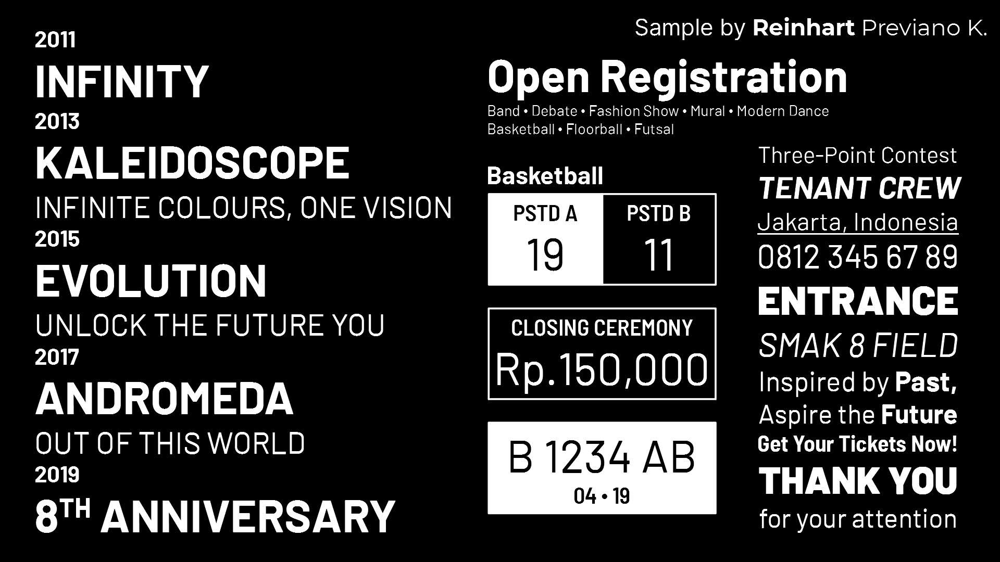

# Universe Design System

[Documentation](index.html)

Universe is an evolution of a previously-rejected design proposal meant for use across digital and physical media. Unlike other design systems, Universe is now meant to adapt to different "media platforms" (e.g. operating systems, app stores, social media) while being consistent with branding and design standards.

